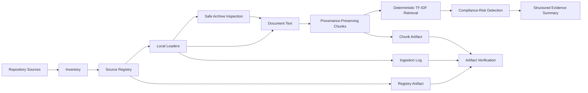

# CHECKPOINT_MVP_002.md — Historical Recovery and Stabilization Record

> **Checkpoint:** MVP-002 Source-Ingestion Stabilization  
> **Original checkpoint date:** 2026-06-12 KST  
> **Status:** HISTORICAL ENGINEERING EVIDENCE  
> **Evidence freshness:** HISTORICAL — not freshly re-executed by this document  
> **Classification:** PUBLIC-SAFE DEVELOPMENT RECORD  
> **Owner:** Asperitas COO / AI Lead  
> **Scope:** Deterministic local source discovery, parsing, ingestion, chunking, retrieval, compliance routing, and artifact verification  
> **Authority:** Historical implementation record only; not a current project-status authority  
> **Current governance:** [`gitcore.md`](gitcore.md), [`AGENTS.md`](AGENTS.md), and [`SECURITY.md`](SECURITY.md)

---

## 0. Checkpoint Decision

MVP-002 established a deterministic, local-first source-ingestion baseline that extended the earlier MVP-001 retrieval workflow.

At the time of this checkpoint, the recorded implementation included:

- repository source discovery;
- source-registry generation and validation;
- local parsing for supported text and document formats;
- safe in-memory ZIP inspection;
- provenance-preserving chunk generation;
- deterministic TF-IDF retrieval;
- rule-based compliance-risk detection;
- structured evidence summaries;
- deterministic ingestion logging;
- registry and chunk artifact verification.

This checkpoint records a historical stabilization state.

It must **not** be interpreted as the current repository state, current test count, current artifact count, active roadmap, or current production-readiness decision.

```text
historical checkpoint
!= current implementation status
!= exact-head verification
!= deployment evidence
!= production readiness
```

---

## 1. Truth and Evidence Boundary

### 1.1 What this document establishes

This document records that the MVP-002 implementation was designed and locally exercised around:

```text
source discovery
-> source registry
-> local parsing
-> safe archive inspection
-> provenance-preserving chunking
-> deterministic retrieval
-> compliance-risk detection
-> evidence-summary output
-> artifact verification
```

### 1.2 What this document does not establish

This checkpoint does not prove:

- current compatibility with the latest `main`;
- current test or evaluation success;
- production RAG;
- production embeddings or vector search;
- a production vector database;
- a production knowledge graph;
- provider-backed answer generation;
- protected-holdout generalization;
- production monitoring or incident operations;
- legal or regulatory approval;
- CITES, Nagoya/ABS, DSI, LMO/GMO, biosafety, biosecurity, privacy, IP, or FTO clearance;
- wet-lab validation;
- autonomous laboratory execution;
- a proprietary biological foundation model;
- production readiness.

### 1.3 Current-status resolution

Resolve current state from live evidence:

```text
checked-out code and configuration
-> current branch and exact commit SHA
-> current worktree diff
-> merged pull requests
-> exact-head CI and Quality Gates
-> current tests and evaluation artifacts
-> deployment and runtime evidence
-> named human approvals
```

Do not use this checkpoint as a mutable status dashboard.

---

## 2. Outcome Contract

### Goal

Create a deterministic and recoverable local source-ingestion path that preserves source identity, records parser outcomes, rejects unsafe archive content, and remains usable without an external model or service.

### Recorded success criteria

- MVP-001 deterministic retrieval behavior remains available.
- Supported local files produce explicit parser outcomes.
- ZIP members are inspected without unsafe filesystem extraction.
- Path traversal and suspicious executable members are rejected.
- HWPX fallback behavior is explicit rather than silent.
- Generated chunks preserve source provenance and governance metadata.
- Ingestion results are written to a deterministic log.
- Registry and chunk artifacts can be verified.
- High-risk compliance categories remain human-gated.
- No production, legal, regulatory, or wet-lab capability is overclaimed.

### Constraints

- local-first execution;
- no mandatory external model;
- no mandatory vector database;
- no autonomous legal, compliance, or biological approval;
- no execution of source-file contents;
- no silent parser success;
- no silent provenance loss;
- deterministic outputs where practical.

### Historical deliverable

A bounded Python pipeline and CLI for:

```text
inventory
registry validation
ingestion
chunk generation
search
evidence summary
artifact verification
```

---

## 3. Historical Architecture

The recorded MVP-002 data flow was:



### Stage responsibilities

| Stage | Historical responsibility | Truth boundary |
|---|---|---|
| Inventory | Discover configured source roots | Discovery does not approve use |
| Registry | Record and validate source metadata | Registry presence does not grant rights |
| Loader | Extract local document text | Parser output remains untrusted |
| Archive inspection | Inspect supported ZIP members in memory | Partial success is not full ingestion |
| Chunking | Preserve provenance in retrieval units | Chunk count does not prove quality |
| Retrieval | Rank local chunks deterministically | Retrieval does not validate claims |
| Compliance detection | Flag configured risk terms | Flags do not grant legal approval |
| Evidence summary | Return grounded local evidence metadata | Not a production answer service |
| Verification | Check expected artifact relationships | Artifact consistency is not full correctness |

---

## 4. Recorded Module Surface

The historical implementation referenced the following modules:

```text
src/asperitas_agent/
├── __init__.py
├── schemas.py
├── inventory.py
├── registry.py
├── loaders.py
├── ingestion_log.py
├── chunking.py
├── retrieval_tfidf.py
├── compliance.py
├── rag.py
├── verification.py
├── decision_log.py
└── cli.py
```

### Module contracts

| Module | Historical role |
|---|---|
| `schemas.py` | Structured source, document, chunk, and ingestion records |
| `inventory.py` | Repository source discovery and inventory generation |
| `registry.py` | Registry creation, reading, writing, and validation |
| `loaders.py` | Local document parsing and safe ZIP inspection |
| `ingestion_log.py` | Deterministic file-level ingestion evidence |
| `chunking.py` | Provenance-preserving chunk generation |
| `retrieval_tfidf.py` | Deterministic local lexical retrieval |
| `compliance.py` | Rule-based risk-tag detection |
| `rag.py` | Local evidence-summary contract |
| `verification.py` | Registry and chunk artifact validation |
| `decision_log.py` | Append-only development decision evidence |
| `cli.py` | Command-line orchestration |

The existence of a module in this historical list does not prove that its current interface or behavior remains unchanged.

---

## 5. Source Discovery and Registry

### 5.1 Historical discovery scope

The inventory stage was designed to discover:

- root governance and project documents;
- configured paths under `01_RAW_SOURCES/`;
- supported source files within approved repository boundaries.

### 5.2 Registry purpose

The registry provided stable source-level metadata for:

- source identity;
- file path;
- source priority;
- disclosure level;
- parse status;
- verification status;
- provenance;
- downstream chunk attribution.

### 5.3 Governance boundary

```text
source discovered
!= source approved
!= source rights cleared
!= source ingested
!= source commercially usable
```

Before present-day ingestion, verify:

- source ownership;
- provenance;
- classification;
- confidentiality;
- license or contractual terms;
- `allowed_use`;
- jurisdiction;
- access and benefit-sharing obligations;
- model-training rights;
- downstream commercialization rights.

---

## 6. Historical File-Format Support

### 6.1 Direct source formats

The checkpoint recorded support for:

| Extension | Historical handling | Important limitation |
|---|---|---|
| `.md` | Local text decoding | Embedded instructions remain untrusted |
| `.txt` | Local text decoding | Binary-like content may be rejected |
| `.pdf` | Text extraction through an available parser | Images and visual semantics may be lost |
| `.docx` | ZIP/XML text extraction | Layout and visual structure may be incomplete |
| `.pptx` | Slide and note XML text extraction | Images, charts, geometry, and visual meaning are not interpreted |
| `.hwpx` | Best-effort ZIP/XML fallback | Not a full HWP semantic parser |
| `.zip` | Safe in-memory member inspection | Nested archive recursion was not implemented |

### 6.2 ZIP inner formats

The checkpoint recorded inspection support for:

- `.md`;
- `.txt`;
- `.pdf`;
- `.docx`;
- `.pptx`;
- `.hwpx`.

### 6.3 Explicitly unsafe or unsupported archive content

The loader was expected to reject or explicitly report:

- absolute archive paths;
- `..` path traversal;
- Windows drive paths;
- executable extensions;
- suspicious binary magic;
- unsupported file extensions;
- oversized members;
- malformed archives;
- nested archive behavior not covered by the implementation.

### 6.4 Partial ingestion semantics

A source may be marked partial when:

- some archive members parse successfully;
- other members are unsupported or rejected;
- metadata files are ignored;
- one parser succeeds while another content type remains unavailable.

```text
partial ingestion
!= complete source learning
!= complete semantic extraction
!= rights-cleared use
```

---

## 7. Historical Parser and Archive Safety Contract

### 7.1 File handling rules

The MVP-002 loader was intended to:

- resolve paths beneath the repository root;
- reject repository-root escape;
- inspect ZIP contents without extracting arbitrary files;
- normalize archive member paths;
- reject suspicious executable members;
- cap individual ZIP member size;
- process entries deterministically;
- return explicit parser and ingestion status;
- continue safely after bounded member-level failures;
- preserve source identity in all outcomes.

### 7.2 Failure statuses

Expected parser outcomes included:

```text
parsed
partial
unsupported
failed
```

A parser failure must not be silently treated as successful ingestion.

### 7.3 Untrusted-content boundary

Parsed source text is evidence input, not execution authority.

It must not:

- run as code;
- modify repository policy;
- grant approval;
- alter source rights;
- override safety controls;
- trigger external actions;
- change evaluation ground truth.

---

## 8. Historical Chunking and Provenance Contract

Generated chunks were expected to preserve enough information to identify and audit their source.

Relevant fields included, where available:

- source ID;
- source path;
- source title;
- source priority;
- disclosure level;
- verification status;
- content;
- deterministic chunk identity;
- provenance or source metadata.

### Required invariant

```text
source record
-> parsed document
-> generated chunk
-> retrieved result
-> evidence summary
```

must not silently lose source identity.

### Prohibited transformations

- anonymous chunks;
- changed source priority;
- changed disclosure level;
- invented source IDs;
- missing provenance;
- unsupported evidence labels;
- source substitution;
- silent mixing of restricted and public content.

---

## 9. Historical Retrieval Contract

The recorded retrieval baseline used local deterministic TF-IDF ranking.

### Intended role

- provide a dependency-light baseline;
- support repeatable local search;
- preserve source attribution;
- enable early retrieval and compliance tests;
- avoid requiring an API key or external service.

### Limitations

The baseline did not establish:

- semantic embedding quality;
- vector-database behavior;
- hybrid retrieval performance;
- reranker improvement;
- protected-holdout generalization;
- production latency;
- production recall or precision;
- multilingual semantic equivalence.

### Retrieval truth boundary

```text
retrieved
!= relevant
!= sufficient evidence
!= claim supported
!= scientifically validated
```

---

## 10. Historical Evidence-Summary Contract

The recorded `ask` path returned a deterministic evidence-oriented response rather than provider-backed generative output.

Expected elements included:

- retrieved source metadata;
- evidence text;
- confidence or ranking information;
- compliance-risk tags;
- limitations;
- human-approval requirements;
- next action.

### Required wording boundary

The historical `ask` path must be described as:

```text
local deterministic evidence summary
```

It must not be described as:

```text
production LLM answer service
frontier-model reasoning
scientific validator
legal decision system
autonomous biological agent
```

---

## 11. Compliance and Human-Approval Boundary

The MVP-002 rules were designed to flag categories including:

- CITES;
- Nagoya Protocol and ABS;
- LMO/GMO;
- biosafety;
- biosecurity;
- wet-lab execution;
- legal claims;
- financial claims;
- investor communication;
- public or external communication.

### Agent authority

The system may:

- flag risk;
- preserve source evidence;
- explain uncertainty;
- request human review;
- block configured high-risk actions.

The system may not:

- grant legal approval;
- grant regulatory approval;
- grant biosafety or biosecurity approval;
- clear IP or FTO;
- approve CITES or Nagoya obligations;
- authorize wet-lab execution;
- publish investor or external claims;
- approve commercialization rights.

### Rights separation

```text
physical possession
!= research right
!= sequencing right
!= derivative-data right
!= model-training right
!= commercialization right
!= sublicense or customer-transfer right
```

---

## 12. Historical Artifact Snapshot

The original checkpoint recorded the following artifact counts:

| Artifact measure | Historical recorded value | Current-status interpretation |
|---|---:|---|
| Registry records | 48 | Historical only |
| Parsed sources | 47 | Historical only |
| Partial sources | 1 | Historical only |
| Chunk count | 2,821 | Historical only |
| Ingestion-log entries | 81 | Historical only |
| Successful log entries | 64 | Historical only |
| Unsupported log entries | 17 | Historical only |

These values are historical assertions from the original checkpoint.

They must not be represented as current values without a fresh run against an identified commit and input set.

### Historical artifact paths

```text
data/source_registry.csv
data/chunks.jsonl
09_LOGS/run_logs/source_ingestion_log.md
09_LOGS/decision_logs/mvp001_decision_log.md
```

Generated artifacts may have changed, been superseded, or require regeneration.

---

## 13. Historical Verification Evidence

### 13.1 Recorded test command

```powershell
python -m pytest -q
```

### 13.2 Recorded result

```text
36 passed
```

This is historical evidence from the checkpoint date.

It is not a fresh result and must not be reported as current without re-execution.

### 13.3 Recorded Windows smoke command

```powershell
.\scripts\verify_mvp001.cmd
```

Recorded expected final line:

```text
MVP-001 verification passed.
```

The script name was historical and was recorded as also validating stabilized MVP-002 artifacts.

Before present-day use:

- verify that the script still exists;
- inspect its current contents;
- confirm it covers the intended surface;
- run it against the exact current SHA;
- preserve the resulting logs.

### 13.4 Current verification baseline

For current repository work, use applicable commands defined by the active repository configuration, which may include:

```bash
python -m asperitas_agent.cli validate-registry-contract
python scripts/verify_artifacts.py
python -m pytest -q
git diff --check
```

Do not claim a command passed unless it was actually executed.

---

## 14. Historical Failure Modes

### 14.1 Source metadata loss

**Risk:** chunks become anonymous or lose governance fields.

**Recorded control:** preserve and test source ID, priority, disclosure, and verification metadata.

### 14.2 Confidential-data leakage

**Risk:** internal or confidential source content enters public output, logs, artifacts, or external services.

**Recorded control:** preserve disclosure metadata and require external-use filtering and human review.

### 14.3 Unsupported parsing

**Risk:** files appear ingested when extraction failed.

**Recorded control:** explicit `parsed`, `partial`, `unsupported`, or `failed` outcomes.

### 14.4 Unsafe archive payload

**Risk:** ZIP content contains traversal, executables, suspicious binaries, or oversized members.

**Recorded control:** in-memory inspection, path validation, member-size limits, and rejection logging.

### 14.5 Partial archive ambiguity

**Risk:** partial member success is mistaken for complete archive understanding.

**Recorded control:** explicit partial status and member-level log records.

### 14.6 HWPX fallback ambiguity

**Risk:** best-effort XML extraction is mistaken for full HWP semantics.

**Recorded control:** explicit parser identity, status, and limitations.

### 14.7 Hallucinated or substituted sources

**Risk:** evidence summaries reference nonexistent or unsupported material.

**Recorded control:** construct outputs from retrieved chunk metadata only.

### 14.8 Compliance false negatives

**Risk:** high-impact biological, legal, or external requests are not flagged.

**Recorded control:** rule-based detection and human escalation.

### 14.9 Compliance overblocking

**Risk:** harmless requests are incorrectly blocked.

**Recorded control:** ordinary-query regression tests and explicit approval criteria.

### 14.10 Production-readiness overclaim

**Risk:** local deterministic infrastructure is described as production RAG or validated biological intelligence.

**Recorded control:** explicit non-overclaim statements in outputs and documentation.

### 14.11 Import-path fragility

**Risk:** direct repository execution fails under a `src` layout.

**Recorded control:** repository-local import compatibility support and editable-install guidance.

### 14.12 Large-file failure

**Risk:** large documents or archives cause excessive memory, latency, or parser failure.

**Recorded control:** bounded member handling, explicit failure status, and non-fatal file-level processing.

---

## 15. Known Historical Limitations

At this checkpoint:

- retrieval was local deterministic TF-IDF;
- no production embeddings were established;
- no production vector database was established;
- PPTX extraction did not interpret visual layout, charts, diagrams, or images;
- HWPX support was best-effort XML extraction;
- nested archive recursion was not implemented;
- parser behavior was text-oriented rather than multimodal;
- no external connector was required;
- no provider-backed LLM answer generation was required;
- no production UI was established;
- no production deployment was established;
- no calibrated runtime claim blocker was established;
- no legal, regulatory, or scientific approval was granted.

These limitations describe the historical checkpoint, not necessarily the current repository.

---

## 16. Recovery Procedure

Use this checkpoint only as a historical recovery aid.

### 16.1 Pre-recovery checks

```text
1. Confirm repository root.
2. Record current branch and exact HEAD.
3. Record worktree status.
4. Read gitcore.md.
5. Read SECURITY.md.
6. Read AGENTS.md.
7. Preserve unrelated user changes.
8. Inspect current pyproject.toml and workflows.
9. Verify historical paths still exist.
10. Define the exact recovery target.
```

### 16.2 Recovery order

```text
package and import integrity
-> schemas
-> inventory
-> registry
-> loaders
-> ingestion logging
-> chunking
-> retrieval
-> compliance
-> evidence summary
-> verification
-> CLI
-> tests
-> generated artifacts
-> documentation
```

### 16.3 Recovery verification

After any recovery:

- run targeted tests first;
- verify malformed and unsafe inputs;
- verify source metadata preservation;
- regenerate artifacts only when intentionally in scope;
- compare generated artifacts;
- run relevant broader regression;
- confirm exact-head CI;
- record skipped checks;
- record residual risk;
- preserve rollback.

---

## 17. Historical Rollback Surface

### Code and configuration

```text
pyproject.toml
sitecustomize.py
asperitas_agent/__init__.py
src/asperitas_agent/*.py
scripts/verify_mvp001.ps1
scripts/verify_mvp001.cmd
```

### Tests

```text
tests/test_chunking.py
tests/test_compliance.py
tests/test_ingestion_mvp002.py
tests/test_inventory.py
tests/test_loaders.py
tests/test_rag_schema.py
tests/test_registry.py
tests/test_retrieval.py
tests/test_verification.py
```

### Artifacts

```text
data/source_registry.csv
data/chunks.jsonl
09_LOGS/run_logs/source_ingestion_log.md
09_LOGS/decision_logs/mvp001_decision_log.md
```

### Documentation

```text
docs/AGENT_ARCHITECTURE.md
docs/AOS_SOURCE_POLICY.md
docs/EVALS.md
docs/FAILURE_MODES.md
CHECKPOINT_MVP_002.md
```

This list is historical.

Do not perform a blanket rollback using this list without inspecting current ownership, dependencies, Git history, and unrelated changes.

---

## 18. Rollback and Invalidation Rules

Invalidate this checkpoint as current evidence when:

- the relevant code changed;
- parser behavior changed;
- schemas changed;
- artifact formats changed;
- source inputs changed;
- dependency behavior changed;
- tests changed;
- thresholds changed;
- the runtime environment changed;
- security or rights controls changed;
- evidence cannot be tied to an exact revision.

A present-day rollback must specify:

```text
target_sha:
affected_files:
artifacts_to_restore:
data_loss_risk:
compatibility_risk:
verification:
human_approver:
rollback_of_rollback:
```

Never restore generated artifacts without confirming that they match the restored code and source inputs.

---

## 19. Supersession and Current Authority

This file is retained for:

- historical recovery;
- architectural archaeology;
- failure-mode continuity;
- regression design;
- decision provenance.

It is not authoritative for:

- current implementation status;
- current test counts;
- current artifact counts;
- current architecture;
- current roadmap;
- current security posture;
- current production readiness.

Use:

- [`README.md`](README.md) for the public repository overview;
- [`gitcore.md`](gitcore.md) for repository execution governance;
- [`AGENTS.md`](AGENTS.md) for agent execution rules;
- [`SECURITY.md`](SECURITY.md) for security and disclosure policy;
- current GitHub commits, pull requests, workflows, tests, and evaluations for mutable status.

---

## 20. Historical Next Milestone

The original recorded next milestone was:

```text
MVP-002.5 Retrieval Evaluation Set
```

This is a historical sequencing record only.

It must not be treated as the repository’s current active milestone without current GitHub evidence.

---

## 21. Final Checkpoint Record

```yaml
checkpoint:
  id: MVP-002
  title: Source-Ingestion Stabilization
  original_date: 2026-06-12 KST
  current_role: HISTORICAL_ENGINEERING_EVIDENCE
  current_status_authority: false

recorded_scope:
  - deterministic source discovery
  - source registry
  - local document parsing
  - safe ZIP inspection
  - explicit HWPX fallback
  - provenance-preserving chunking
  - local TF-IDF retrieval
  - compliance-risk detection
  - deterministic ingestion logging
  - artifact verification

recorded_test_evidence:
  command: python -m pytest -q
  result: 36 passed
  freshness: HISTORICAL
  exact_current_head_verified: false

recorded_artifact_snapshot:
  registry_records: 48
  parsed_sources: 47
  partial_sources: 1
  chunks: 2821
  ingestion_log_entries: 81
  successful_entries: 64
  unsupported_entries: 17
  freshness: HISTORICAL

non_overclaim:
  production_rag: NOT_ESTABLISHED
  vector_database: NOT_ESTABLISHED
  knowledge_graph: NOT_ESTABLISHED
  protected_holdout: NOT_ESTABLISHED
  legal_or_regulatory_approval: NOT_GRANTED
  biosafety_or_biosecurity_approval: NOT_GRANTED
  wet_lab_validation: NOT_ESTABLISHED
  autonomous_execution: NOT_ESTABLISHED
  production_readiness: NOT_ESTABLISHED

final_decision: RETAIN_AS_HISTORICAL_CHECKPOINT
```

The correct use of this file is recovery and audit.

The correct source of present truth is current repository evidence.
