# Asperitas AI RAG Agent

[](https://github.com/neo6bs988-dev/asperitas--RAG-agent/actions/workflows/ci.yml)
[](https://github.com/neo6bs988-dev/asperitas--RAG-agent/actions/workflows/quality-gates.yml)
[](pyproject.toml)
[](SECURITY.md)
[](#license)

**Deterministic, source-grounded, compliance-aware RAG development infrastructure for biological evidence workflows.**

This repository builds the smallest verifiable control plane required to transform biological and biodiversity-derived information into traceable, reviewable, and measurable evidence workflows.

> **Evidence boundary:** Repository documents, prompts, schemas, fixtures, tests, and architecture diagrams are not proof of production deployment, scientific validation, legal clearance, regulatory approval, product-market fit, or foundation-model capability. Current implementation status must be verified from the checked-out revision, exact-head CI, evaluation artifacts, deployment evidence, and named human approvals.

---

## Executive Bottom Line

The repository is designed around five operating commitments:

1. **Source governance before ingestion**  
   Sources require stable identity, provenance, classification, verification status, rights metadata, and permitted-use review.

2. **Deterministic baselines before agent complexity**  
   Retrieval, validation, compliance routing, and evaluation begin with inspectable local components.

3. **Evaluation before promotion**  
   A new retriever, reranker, model, workflow, or agent is promoted only when it passes frozen, contamination-resistant evaluation gates.

4. **Human authority for high-impact decisions**  
   Models and agents do not grant legal, regulatory, biosafety, scientific, rights, release, or wet-lab approval.

5. **Evidence-backed capability claims**  
   `DOCUMENTED`, `IMPLEMENTED`, `TESTED`, `CI_VERIFIED`, `DEPLOYED`, and `PRODUCTION_READY` are different states.

The repository currently contains development infrastructure for:

- source-registry contracts and validation;
- local parsing and chunking;
- deterministic lexical and metadata-aware retrieval;
- offline retrieval comparison modes;
- grounding-preserving reranker interfaces;
- compliance-aware evidence summaries;
- development evaluation fixtures and metrics;
- claim-verification components;
- artifact verification;
- GitHub CI and Quality Gates;
- agent, security, and repository governance policies.

It does **not** by itself establish:

- a production RAG service;
- a production vector database or knowledge graph;
- protected-holdout generalization;
- production tracing, monitoring, or incident operations;
- legal, regulatory, CITES, Nagoya/ABS, DSI, LMO/GMO, biosafety, biosecurity, privacy, IP, or FTO clearance;
- wet-lab validation;
- autonomous laboratory execution;
- a proprietary biological foundation model;
- production readiness.

---

## Why This Repository Exists

Biological intelligence systems fail differently from ordinary document-search applications.

A biologically plausible answer may still be unusable because:

- the source is unverified or outdated;
- provenance was lost during parsing or retrieval;
- an evidence span does not support the generated claim;
- the source license or permitted use is unresolved;
- specimen possession is mistaken for sequencing or commercialization rights;
- a prediction is presented as experimental validation;
- a model score is treated as regulatory, biosafety, or legal approval;
- confidential biological data crosses an unauthorized boundary;
- evaluation answer keys contaminate runtime retrieval;
- an agent acts beyond its approved permissions.

This repository treats those failure modes as architectural requirements rather than post-processing concerns.

```text
source governance
-> deterministic parsing
-> provenance-preserving metadata
-> measurable retrieval
-> grounded answer contracts
-> claim-to-evidence verification
-> compliance and approval routing
-> traceable workflows
-> validated product surfaces
```

The long-term Asperitas strategy is:

```text
biodiversity access
-> lawful provenance and rights
-> proprietary biological data
-> source registry / metadata / RAG / KG / eval / trace control plane
-> AI-bio models
-> DBTL validation
-> IP and compliance trust
-> products and licensing
-> biological infrastructure
```

This sequence is a strategic direction, not a claim that every layer is implemented.

---

## Operating Principles

### Evidence over narrative

Current truth is resolved from:

```text
checked-out code and configuration
-> current commit SHA
-> merged pull requests
-> exact-head CI and Quality Gates
-> tests and evaluation artifacts
-> deployment and runtime evidence
-> named approvals
```

A roadmap, README, benchmark, generated report, or prompt does not override live implementation evidence.

### Simple-first architecture

Complexity is introduced only when a lower-complexity pattern repeatedly fails a frozen target.

```text
deterministic helper
-> single model / RAG / tool call
-> fixed workflow
-> stateful workflow
-> agent
-> multi-agent or graph
```

Any complexity increase must document:

- failed baseline;
- target metric;
- expected improvement;
- latency and cost impact;
- security and debugging burden;
- observability;
- human-approval boundary;
- rollback;
- required evaluation evidence.

### No silent capability promotion

| State | Meaning |
|---|---|
| `DOCUMENTED` | Described in a repository artifact |
| `IMPLEMENTED` | Code or configuration exists in the inspected revision |
| `TESTED` | Identified tests ran in the stated environment |
| `CI_VERIFIED` | Required checks passed on the exact evaluated SHA |
| `APPROVED` | A named human granted the specific authority |
| `DEPLOYED` | Deployment evidence exists for a named environment |
| `OPERATIONALLY_VERIFIED` | Runtime behavior was observed against defined criteria |
| `PRODUCTION_READY` | Release, security, operational, compliance, and rollback gates passed |
| `PLANNED` | Intended future work |
| `UNVERIFIED` | Evidence is absent, inaccessible, stale, or insufficient |
| `BLOCKED` | A mandatory gate failed |

---

## Repository Evidence Map

### Current capability truth status

Snapshot baseline: `ec9250387f0cfa4fa209d661fbd01ae0755ec8be`. This SHA records the last verified main state for this documentation sync; live code, validators, and exact-head evidence override it when the repository changes.

| Capability | Status | Evidence | Next gate |
|---|---|---|---|
| Skill Contract v2 foundation | `IMPLEMENTED`, merged and main-verified | `.agents/skill-contract.schema.json`, `src/asperitas_agent/skill_contract.py`, `scripts/validate_skill_contract.py`, focused tests, PR #219 merge | Preserve exact-head contract validation |
| Live Skill manifests | `NOT IMPLEMENTED` — 0 manifests for 30 `SKILL.md` definitions | `python scripts/validate_skill_contract.py --root . --transition --json` reports `PARTIAL`, `ok=false`, `contracts_checked=0` | Separately authorized P1B-2 manifest migration |
| Skill routing migration | `NOT IMPLEMENTED` | Current Python discovery/registry remains incumbent; contract declarations do not change routing | Freeze incumbent baseline, then routing tests and canary |
| Retrieval pipeline | `IMPLEMENTED` development components; production status `UNVERIFIED` | `src/asperitas_agent/`, retrieval tests, development eval artifacts | Clean before/after quality, metadata, latency, context, and cost evidence for each promotion |
| Evaluation suite | `IMPLEMENTED` public development tests/evals; coverage is not complete and no protected holdout is established | `tests/`, `eval/`, `scripts/`, `eval_results/` | Contamination-controlled expansion with fixed datasets and thresholds |
| CI and security checks | `IMPLEMENTED`; exact-head status is revision-specific | `.github/workflows/`, repository ruleset, `SECURITY.md` | Required checks on the exact proposed head; scanner success is not proof of vulnerability absence |
| Production deployment | `NOT IMPLEMENTED` / `UNVERIFIED` | No approved deployment and operational evidence established by this repository snapshot | Separate release, security, operations, ownership, rollback, and deployment approval |
| Legal and rights clearance | `NOT ESTABLISHED`; human-gated | Source metadata and policies are not legal clearance | Named counsel/rights review for the specific source, use, jurisdiction, and transfer |
| Wet-lab validation | `NOT ESTABLISHED`; human-gated | Computational, literature, fixture, and repository evidence are not wet-lab results | Approved protocol, biosafety review, controlled execution, and scientific validation |

| Capability area | Repository evidence | Evidence boundary |
|---|---|---|
| Source registry | `02_SOURCE_REGISTRY/`, `src/asperitas_agent/registry.py`, `src/asperitas_agent/source_registry_contract.py` | Does not prove complete licensed production ingestion |
| Source inventory | `src/asperitas_agent/inventory.py`, CLI inventory command | Inventory does not grant permitted use |
| Local parsing | `src/asperitas_agent/loaders.py` | Parser output remains untrusted input |
| Chunking | `src/asperitas_agent/chunking.py` | Chunk generation does not prove retrieval quality |
| Ingestion evidence | `src/asperitas_agent/ingestion_log.py`, repository artifacts | Logs prove execution, not legal or scientific validity |
| Lexical retrieval | `src/asperitas_agent/retrieval_tfidf.py` | Deterministic development baseline |
| Metadata-aware retrieval | `src/asperitas_agent/retrieval_mvp003.py` | Reference implementation, not production-backend selection |
| Offline vector comparison | `src/asperitas_agent/embeddings.py`, `scripts/run_retrieval_eval.py` | Evaluation infrastructure, not deployed vector service |
| Hybrid comparison | `src/asperitas_agent/hybrid_scoring.py` | Evaluation-only unless independently validated without oracle influence |
| Reranking | `src/asperitas_agent/reranking.py` | Interface and deterministic test controls do not prove ranking improvement |
| Evidence summaries | `src/asperitas_agent/rag.py` | Local evidence-summary path, not a production answer service |
| Compliance routing | `src/asperitas_agent/compliance.py` | Risk tagging does not grant legal or regulatory approval |
| Claim extraction | `src/asperitas_agent/claim_extractor.py` | Extracted claims remain subject to validation |
| Evidence matching | `src/asperitas_agent/evidence_span_matcher.py` | Diagnostic support, not final scientific or legal judgment |
| Answer verification | `src/asperitas_agent/answer_verification_integration.py` | Runtime enforcement status must be verified separately |
| Evaluation | `eval/`, `scripts/`, `tests/` | Public development fixtures are not protected holdouts |
| Artifact verification | `scripts/verify_artifacts.py` | Artifact consistency does not prove system correctness |
| CI and Quality Gates | `.github/workflows/` | Passing checks do not prove deployment or vulnerability absence |
| Security governance | `SECURITY.md` | Policy is not enforcement |
| Agent governance | `AGENTS.md` | Instructions are not proof of autonomous runtime |
| Repository governance | `gitcore.md` | Governance document requires CI, rulesets, and human enforcement |

---

## Architecture

```mermaid
flowchart LR
    A["Registered Sources<br/>identity · provenance · rights"] --> B["Local Parsing<br/>text · PDF · DOCX · PPTX · ZIP"]
    B --> C["Chunking and Metadata<br/>source ID · evidence span · classification"]
    C --> D["Deterministic Retrieval<br/>lexical · metadata-aware"]
    C --> E["Comparison Paths<br/>vector · hybrid · reranker"]

    D --> F["Evidence Summary<br/>citations · limitations · risk tags"]
    E --> G["Evaluation Harness<br/>metrics · leakage guards · regression"]
    F --> H["Claim Verification<br/>extract · match · classify"]
    G --> I["Promotion Decision<br/>pass · fail · invalid · defer"]
    H --> J["Human Approval Gate<br/>rights · compliance · release"]

    J -. planned .-> K["Provider-Neutral Grounded Answer Path"]
    K -. planned .-> L["Internal API / UI Dogfood"]
    L -. planned .-> M["DBTL and Proprietary Data Feedback"]
    M -. evidence gated .-> N["KG / Active Learning / Model Readiness"]

    classDef implemented fill:#e8f5e9,stroke:#2e7d32,color:#111;
    classDef evaluation fill:#e3f2fd,stroke:#1565c0,color:#111;
    classDef gated fill:#fce4ec,stroke:#ad1457,color:#111;
    classDef planned fill:#fff8e1,stroke:#f9a825,color:#111;

    class A,B,C,D,F,G,H,I implemented;
    class E evaluation;
    class J gated;
    class K,L,M,N planned;
```



### Architectural boundaries

**Implemented-development boundary**

- local source registration and validation;
- parsing and chunking;
- deterministic retrieval;
- evidence-summary contracts;
- compliance-risk tagging;
- evaluation utilities;
- tests and artifact verification.

**Evaluation-only boundary**

- offline vector comparisons;
- hybrid comparison paths;
- deterministic test rerankers;
- public-safe biology and compliance development fixtures.

**Human-gated boundary**

- source approval;
- rights clearance;
- legal and regulatory conclusions;
- scientific validation claims;
- investor, partner, or public statements;
- release and deployment;
- wet-lab execution.

**Planned boundary**

- production-shaped provider-backed answer generation;
- calibrated runtime claim verification;
- production tracing and monitoring;
- authenticated product surfaces;
- private data operations;
- KG and DBTL integration;
- active learning;
- foundation-model-readiness datasets.

---

## Repository Structure

```text
.
├── .agents/skills/              # Reusable coding-agent skills
├── .github/
│   ├── workflows/               # CI and Quality Gates
│   └── ISSUE_TEMPLATE/          # Structured issue intake
├── 00_ADMIN/                    # Administrative source and registry artifacts
├── 01_RAW_SOURCES/              # Registered source material by authority class
├── 02_SOURCE_REGISTRY/          # Source-registry contracts and examples
├── 05_RAG_PIPELINE/             # Historical or auxiliary pipeline utilities
├── 08_WORKFLOWS/                # Workflow artifacts
├── 09_LOGS/
│   ├── decision_logs/           # Reviewable decisions
│   └── run_logs/                # Development execution evidence
├── apps/                        # Internal application surfaces
├── data/                        # Local deterministic pipeline artifacts
├── docs/                        # Architecture, policies, gates, and technical records
├── eval/                        # Public development evaluation fixtures
├── eval_results/                # Generated evaluation evidence
├── scripts/                     # Validation, diagnostics, and evaluation commands
├── src/asperitas_agent/         # Installable Python package
├── tests/                       # Unit, regression, security, and evaluation tests
├── AGENTS.md                    # Coding-agent operating constitution
├── SECURITY.md                  # Security and disclosure policy
├── gitcore.md                   # Repository execution constitution
├── pyproject.toml               # Build, dependency, test, lint, and typing config
└── README.md                    # Public repository interface
```

Historical artifacts may remain for auditability. Their presence does not make them current authority.

---

## Requirements

- Python `>=3.10`
- Python 3.11 is used by the current GitHub Actions workflows
- Git
- A local virtual environment
- Optional parser dependencies for PDF and DOCX support

The deterministic core intentionally minimizes mandatory third-party dependencies.

---

## Quick Start

### Windows PowerShell

```powershell
git clone https://github.com/neo6bs988-dev/asperitas--RAG-agent.git
cd asperitas--RAG-agent

py -3.11 -m venv .venv
.\.venv\Scripts\Activate.ps1

python -m pip install --upgrade pip
python -m pip install -e ".[dev,parsers]"

python -m asperitas_agent.cli validate-registry-contract
python -m pytest -q
```

### Linux or macOS

```bash
git clone https://github.com/neo6bs988-dev/asperitas--RAG-agent.git
cd asperitas--RAG-agent

python3.11 -m venv .venv
source .venv/bin/activate

python -m pip install --upgrade pip
python -m pip install -e ".[dev,parsers]"

python -m asperitas_agent.cli validate-registry-contract
python -m pytest -q
```

### Optional development toolsets

```bash
# Lint, formatting, typing, and coverage tools
python -m pip install -e ".[dev,parsers,quality]"

# Dependency vulnerability scanner
python -m pip install -e ".[dev,security]"

# Internal Streamlit UI dependencies
python -m pip install -e ".[dev,parsers,ui]"

# Local package-build validation
python -m pip install -e ".[dev,packaging]"
```

The repository is not licensed or configured for public package publication. Packaging tools are for local validation only.

---

## CLI

The package installs the following command:

```bash
asperitas-agent
```

The module form is also supported:

```bash
python -m asperitas_agent.cli
```

### Validate the active local registry

```bash
python -m asperitas_agent.cli validate-registry
```

### Validate the source-registry contract

```bash
python -m asperitas_agent.cli validate-registry-contract
```

Optional explicit contract path:

```bash
python -m asperitas_agent.cli validate-registry-contract \
  --path 02_SOURCE_REGISTRY/source_registry.example.json
```

### Build a local inventory

```bash
python -m asperitas_agent.cli inventory
```

Inventory does not approve sources for ingestion. Review classification, provenance, rights, confidentiality, license, and `allowed_use` first.

### Run local ingestion

```bash
python -m asperitas_agent.cli ingest
```

Do not ingest confidential, restricted, unlicensed, unreviewed, or rights-ambiguous sources into a public or externally connected environment.

### Search existing chunks

```bash
python -m asperitas_agent.cli search \
  "Nagoya Protocol evidence requirements" \
  --limit 5
```

### Produce a deterministic evidence summary

```bash
python -m asperitas_agent.cli ask \
  "What evidence supports this claim?" \
  --limit 5
```

The `ask` command is a local evidence-summary path. It must not be represented as a frontier-model answer service, scientific validator, legal decision system, or production RAG endpoint.

### Verify generated artifacts

```bash
python -m asperitas_agent.cli verify-artifacts
```

Equivalent script entry point:

```bash
python scripts/verify_artifacts.py
```

---

## Retrieval Evaluation

### Available comparison modes

```bash
python scripts/run_retrieval_eval.py --retriever baseline --limit 5
python scripts/run_retrieval_eval.py --retriever mvp003 --limit 5
python scripts/run_retrieval_eval.py --retriever vector --limit 5
python scripts/run_retrieval_eval.py --retriever hybrid --limit 5
```

Interpretation:

| Mode | Intended use | Promotion boundary |
|---|---|---|
| `baseline` | Deterministic lexical baseline | Reference for regression comparisons |
| `mvp003` | Deterministic metadata-aware reference | Protected from casual replacement; not a production claim |
| `vector` | Dependency-free offline vector comparison | Not evidence of deployed embeddings or vector infrastructure |
| `hybrid` | Hybrid comparison path | Must not be promoted when evaluation-specific oracle information influences behavior |

### Evaluation integrity

Before a material evaluation, freeze:

```text
eval_id:
code_sha:
dataset_version:
query_set:
ground_truth_boundary:
retriever_and_reranker_versions:
top_k:
metrics:
thresholds:
critical_cases:
prohibited_oracle_fields:
randomness_and_trials:
grader:
```

The following are prohibited:

- answer-key or hidden-label leakage into runtime components;
- retrieval informed by expected source, expected section, or answer rationale;
- threshold weakening after observing failure;
- tuning on a protected holdout;
- counting skipped, partial, invalid, or not-testable cases as passes;
- selecting only favorable seeds or runs;
- hiding negative results that affect promotion;
- comparing systems under different inputs or environments without disclosure.

A contaminated evaluation is `INVALID`, not `PASS`.

---

## Evaluation Measures

Depending on the evaluated mode and artifact version, repository evaluations may report:

- strict expected-source hit rate;
- source match at rank cutoffs;
- source-priority match;
- evidence-label match;
- section match;
- path-context match;
- reciprocal-rank metrics;
- source-deduplicated ranking metrics;
- source coverage;
- candidate preservation;
- reranker fallback behavior;
- metadata preservation;
- overall critical-case pass rate;
- latency;
- context size;
- token or compute proxies;
- repeated-trial variance where nondeterminism exists.

Metrics are meaningful only when their dataset identity, configuration, code SHA, thresholds, and contamination boundary are preserved.

### Evidence classes

| Evidence class | Meaning |
|---|---|
| `Fresh Run` | Re-executed against the stated revision and inputs |
| `Historical` | Previously recorded but not freshly reverified |
| `Public Development Fixture` | Synthetic or development-safe regression evidence |
| `Shadow / Diagnostic` | Observes behavior without granting blocking or approval authority |
| `Protected Holdout` | Segregated evaluation data with controlled access and qualified review |
| `Contaminated / Invalid` | Evidence that must not be used for promotion |

Public development fixtures are not protected-holdout generalization evidence.

---

## Testing and Quality Gates

### Smallest CI-aligned checks

```bash
python -m asperitas_agent.cli validate-registry-contract
python scripts/verify_artifacts.py
python -m pytest -q
git diff --check
```

### Targeted test examples

```bash
python -m pytest -q tests/test_loaders.py
python -m pytest -q tests/test_retrieval_eval.py
python -m pytest -q tests/test_reranking.py
python -m pytest -q tests/test_claim_extractor.py
```

### Optional quality checks

```bash
ruff check src tests scripts
ruff format --check src tests scripts
mypy src/asperitas_agent
coverage run -m pytest
coverage report
```

These tools become required gates only when repository workflows explicitly enforce them. Configuration in `pyproject.toml` alone does not prove enforcement.

### CI behavior

The repository uses two primary workflows:

- **CI** — source-registry validation, pytest, artifact checks, diff validation, and changed-surface handling.
- **Quality Gates** — development evaluation validators, unit tests, artifact verification, chunk metadata audits, and retrieval evaluations.

Required checks must pass on the exact commit being evaluated. A successful run on an older SHA is not sufficient.

Passing CI means the configured checks passed. It does not establish:

- absence of vulnerabilities;
- production deployment;
- scientific validity;
- legal or regulatory approval;
- production readiness.

---

## Source Governance

No source enters ingestion merely because it exists in the repository.

### Required source lifecycle

```text
candidate
-> needs_review
-> approved
-> ingested
```

Alternative states:

```text
blocked
revoked
expired
superseded
quarantined
```

### Minimum source fields

```text
source_id:
title:
origin:
owner:
version_or_date:
content_hash:
classification:
license_or_terms:
confidentiality:
provenance:
verification_status:
allowed_use:
jurisdiction:
rights_dependencies:
reviewer:
review_date:
lifecycle_status:
```

### Source rules

- preserve source identity through parsing, chunking, retrieval, generation, and citation;
- preserve exact evidence spans where available;
- separate public, internal, confidential, and restricted corpora;
- block revoked or expired sources from new retrieval;
- propagate revocation or deletion to derived artifacts where required;
- do not assume public access grants model-training or commercialization rights;
- do not let retrieved content modify its own authority or permitted use;
- treat metadata as untrusted until validated.

Indexes, embeddings, summaries, caches, and generated features inherit the strongest applicable restrictions of their sources.

---

## Biological Evidence Boundary

Scientific claims follow an evidence ladder:

```text
computational prediction
-> literature-supported hypothesis
-> single assay
-> replicated assay
-> independent validation
-> scale-up
-> production evidence
-> commercial evidence
```

Do not convert:

- sequence similarity into validated function;
- model confidence into biological activity;
- docking output into efficacy;
- one assay into reproducibility;
- a preprint into independent validation;
- a benchmark analogy into Asperitas capability;
- retrieval success into scientific truth.

Negative results, failed experiments, controls, replicates, uncertainty, and provenance are part of the evidence record.

---

## Rights and Compliance Boundary

Biological and biodiversity-derived assets require separate rights analysis.

```text
physical possession
!= source-country access right
!= collection authority
!= research right
!= sequencing right
!= derivative-data right
!= dataset-inclusion right
!= model-training right
!= output or weight right
!= commercialization right
!= sublicense or customer-transfer right
```

Relevant review domains may include:

- CITES;
- Nagoya Protocol and ABS;
- PIC/MAT and benefit sharing;
- DSI obligations;
- LMO/GMO;
- biosafety and biosecurity;
- genetic-resource access;
- confidentiality;
- personal or protected data;
- IP, patentability, FTO, and licensing;
- export control;
- partner and customer restrictions;
- public or investor communications;
- wet-lab execution.

Allowed decision labels are:

```text
ALLOWED
RESTRICTED
BLOCKED
COUNSEL_REVIEW
```

Models and agents may extract, normalize, compare, and flag ambiguity. They may not provide final legal clearance.

---

## Security Model

All external and retrieved content is untrusted data.

This includes:

- uploaded files;
- webpages;
- issue and PR text;
- comments;
- model output;
- tool output;
- generated patches;
- rules files;
- plugins, skills, hooks, and MCP responses.

Untrusted content must not:

- override repository policy;
- expand scope;
- grant permissions;
- change approval state;
- reveal secrets;
- trigger external writes;
- alter evaluation ground truth;
- modify legal or scientific status.

### Permission levels

```text
READ
-> inspect, search, calculate, and analyze

DRAFT
-> prepare patches, plans, reports, and proposed actions

WRITE
-> perform state-changing actions after exact action-level approval
```

Push, merge, release, deployment, deletion, external communication, credential change, registry mutation, production-like data modification, and wet-lab actions require explicit authority.

### Sensitive reporting

Do not report sensitive vulnerabilities through public issues, pull requests, discussions, screenshots, logs, or pasted prompts.

Follow [SECURITY.md](SECURITY.md) and verify that a private reporting route is enabled before transmitting sensitive details.

---

## Data Classification

| Class | Meaning | Public repository handling |
|---|---|---|
| `PUBLIC` | Approved for public disclosure within applicable rights | Allowed after review |
| `INTERNAL` | Development or business information not approved for release | Do not commit without approval |
| `CONFIDENTIAL` | Partner, customer, legal, unpublished, or sensitive operational information | Approved private systems only |
| `RESTRICTED` | Credentials, protected personal data, sensitive biological records, precise locations, or controlled records | Named access and explicit approval required |

This is a public repository. Content committed here must be treated as public disclosure.

Never commit:

- credentials or tokens;
- private keys or recovery codes;
- confidential partner or customer information;
- unpublished sequences or assay data;
- sensitive specimen locations;
- private contracts, permits, PIC/MAT, or legal records;
- protected evaluation answer keys;
- raw confidential corpora;
- private indexes, embeddings, traces, or model states.

---

## Development Workflow

GitHub is the implementation source of truth.

```text
Issue or task contract
-> dedicated branch
-> optional dedicated worktree
-> scope and risk preflight
-> smallest sufficient implementation
-> targeted validation
-> broader regression when justified
-> Draft PR
-> exact-head CI and Quality Gates
-> human review
-> merge decision
-> evidence and learn-back
```

### Before editing

Inspect:

- `gitcore.md`;
- `AGENTS.md`;
- `SECURITY.md`;
- `README.md`;
- `git status`;
- current branch and exact HEAD;
- relevant source and tests;
- existing patterns;
- recent overlapping changes;
- blast radius;
- rollback.

### Branch naming

```text
docs/<short-scope>
fix/<short-scope>
feat/<short-scope>
eval/<short-scope>
security/<short-scope>
codex/<short-scope>
```

### Pull-request contract

A material PR should state:

```text
GOAL:
BASELINE:
IN_SCOPE:
OUT_OF_SCOPE:
CHANGE_CLASS:
CHANGED_FILES:
IMPLEMENTATION:
TESTS_AND_EVALS:
RESULTS:
SECURITY_AND_DATA_REVIEW:
BIOLOGY_RIGHTS_COMPLIANCE_REVIEW:
SKIPPED_CHECKS:
RESIDUAL_RISK:
ROLLBACK:
MERGE_READINESS:
OWNER:
```

### Merge restrictions

Do not mark a change ready or merge when:

- required exact-head checks are unclear;
- the head changed after validation;
- thresholds were weakened to obtain a pass;
- evaluation contamination is unresolved;
- unrelated changes obscure the intended diff;
- security, rights, or biological gates remain unresolved;
- rollback is unavailable;
- required human approval is missing.

---

## Change Classes

| Class | Typical surface | Minimum evidence |
|---|---|---|
| `C0` | Typo or non-semantic documentation | Diff, links, Markdown, `git diff --check` |
| `C1` | Bounded deterministic code | Targeted tests and static/schema checks |
| `C2` | Retrieval, reranking, evals, answer contracts, registries | Frozen baseline, affected and adjacent regression, leakage checks |
| `C3` | Security, permissions, CI, ingestion, tools, confidential data | Threat review, adversarial tests, least privilege, human approval |
| `C4` | Release, deployment, external write, production data, high-risk biology | Explicit approval, rollback rehearsal, post-action verification |

The highest affected class governs the change.

---

## Durable Roadmap

The capability order is intentionally gated:

```text
1. source registry and approved-only ingestion
2. deterministic retrieval baseline
3. leak-free retrieval and reranking candidates
4. reproducible ranking, latency, and context measurement
5. provider-neutral grounded-answer path
6. claim-to-citation verification in diagnostic mode
7. compliance and security adversarial gates
8. tracing, token, cost, and latency control plane
9. internal API and UI dogfood
10. rights-cleared data-product workflows
11. authenticated productization
12. production-readiness review
13. evidence-driven KG and DBTL integration
14. active learning and proprietary dataset compounding
15. biological foundation-model readiness
```

Promotion to the next stage requires evidence from the prior stage.

No roadmap item should be interpreted as implemented merely because it appears here.

---

## Documentation Map

### Repository governance

- [Repository Execution Constitution](gitcore.md)
- [Agent Constitution](AGENTS.md)
- [Security Policy](SECURITY.md)
- [Human + Codex Workflow](docs/WORKFLOW.md)
- [Quality Gates](docs/QUALITY_GATES.md)

### Retrieval and evaluation

- [Retrieval Evaluation Thresholds](docs/RETRIEVAL_EVAL_THRESHOLDS.md)
- [MVP-003 Retrieval Improvement Plan](docs/MVP_003_RETRIEVAL_IMPROVEMENT_PLAN.md)
- [Claim-to-Citation Verifier Design](docs/V1_5B_CLAIM_TO_CITATION_VERIFIER_DESIGN.md)
- [Biology and Compliance Golden-Set Preflight](docs/V1_7A_BIOLOGY_COMPLIANCE_GOLDEN_SET_PREFLIGHT.md)

### Architecture and engineering

- [Agent Architecture](docs/AGENT_ARCHITECTURE.md)
- [Pipeline Automation](docs/PIPELINE_AUTOMATION.md)
- [Failure Modes](docs/FAILURE_MODES.md)
- [AOS Source Policy](docs/AOS_SOURCE_POLICY.md)

Documents with dates, versions, or phase identifiers may be historical evidence rather than current authority. Verify status against live repository evidence.

---

## Contributing

A formal external-contributor contract may be added separately. Until then:

1. Read `gitcore.md`, `AGENTS.md`, and `SECURITY.md`.
2. Open or reference an issue for non-trivial work.
3. Create a narrow branch.
4. Preserve unrelated changes.
5. Reuse existing repository patterns.
6. Run the smallest sufficient validation.
7. Expand regression testing based on risk and blast radius.
8. Open a Draft PR with exact evidence and rollback.
9. Wait for exact-head checks and human review.
10. Do not merge without explicit authority.

Changes involving source governance, retrieval, reranking, evaluation integrity, permissions, dependencies, GitHub Actions, biological data, compliance routing, or release controls require elevated review.

---

## Performance Claims

Any performance claim must include:

```text
metric:
baseline:
candidate:
dataset:
environment:
configuration:
measured_result:
variance:
quality_tradeoff:
latency:
context_or_token_cost:
regression_risk:
```

Do not claim improvement based on:

- a single favorable query;
- a changed dataset;
- different evaluation conditions;
- hidden oracle information;
- subjective review alone;
- untracked prompt changes;
- benchmark prestige;
- increased architecture complexity.

The goal is measurable reliability, not larger agent graphs or stronger wording.

---

## Release and Production-Readiness Boundary

`MERGED`, `TESTED`, `CI_VERIFIED`, `DEPLOYED`, and `PRODUCTION_READY` are different states.

Production readiness requires all applicable evidence:

- reviewed threat model;
- exact-head tests and evaluations;
- source and data-rights review;
- dependency and supply-chain review;
- secrets and permissions verification;
- observability and incident response;
- access control and retention policy;
- deployment and rollback validation;
- operational ownership and SLOs;
- legal, regulatory, biosafety, biosecurity, privacy, IP, and release approvals;
- artifact provenance;
- post-deployment verification.

This repository does not currently claim that those gates are complete.

---

## License

No open-source license has been granted for this repository.

Public visibility does not grant permission to:

- copy;
- modify;
- redistribute;
- sublicense;
- commercially reuse;
- train a model on;
- create derivative datasets from;
- use biological or confidential content beyond applicable rights.

Do not publish this package to PyPI or another public package registry unless the repository owner explicitly approves the release and the license, security, provenance, and production-release gates are satisfied.

---

## Support and Responsible Disclosure

Use GitHub Issues for:

- non-sensitive bugs;
- documentation problems;
- feature proposals;
- public development questions.

Do not place the following in public channels:

- credentials;
- confidential data;
- private source text;
- partner information;
- specimen-level records;
- unpublished biological data;
- protected evaluation material;
- sensitive vulnerability details.

Follow [SECURITY.md](SECURITY.md) for private reporting requirements.

---

## Final Truth Boundary

This repository is a development and governance foundation for source-grounded biological intelligence workflows.

It does not by itself prove:

- production RAG, vector database, or knowledge graph;
- production-grade retrieval or answer quality;
- protected-holdout performance;
- production tracing or security;
- legal or regulatory clearance;
- CITES, Nagoya/ABS, DSI, LMO/GMO, biosafety, biosecurity, privacy, IP, or FTO approval;
- wet-lab validation;
- autonomous laboratory operation;
- proprietary biological data ownership;
- a biological foundation model;
- customer adoption or product-market fit;
- equivalence to private systems or internal practices of any named company or executive.

Only current code, exact-head evaluation, deployment, runtime, scientific, legal, compliance, commercial, and approval evidence can upgrade those claims.
